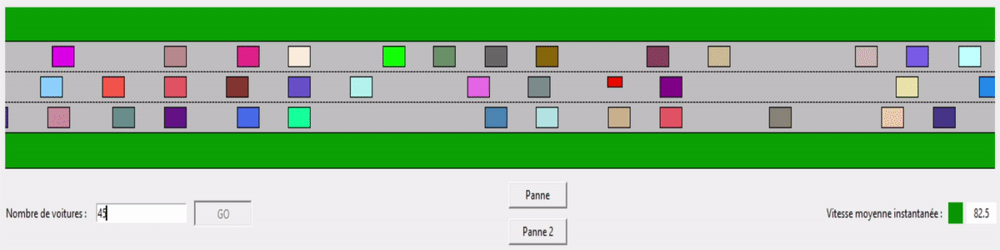

# ARE Road project

Today we are constantly driven to move, whether by car, motorbike, or public transport. The situation today is not comparable to that of 20 or 30 years ago. The density of the road network and the demand for individual mobility have increased considerably. As a result, motorists are subject to a traffic that continues to become more and more complex, with the many risks of problems that this entails. The victims of the road, with the sometimes fatal accidents, or even the Stoppers are ubiquitous and no country is spared, we are all touched. However, Governments are attempting to modify parameters to limit accidents so we will try to change its parameters to see the consequences and to be able to visualize the fluctuations caused. For example if we decrease the speed limit, we increase the distances of safety,… 

The aim of our project will therefore be to translate these different parameter changes into a simulation that we will achieve using the Python language, and that will allow us to see the influence of certain parameter on the State of road traffic. 

# ARE Projet de modélisation de routes

Aujourd'hui nous sommes constamment amenés à nous déplacer que ce soit en voiture, en moto, ou en transport en commun. La situation d’aujourd’hui n’a rien de comparable avec celle d’il y a 20 ou 30 ans. La densité du réseau routier et la demande de mobilité individuelle ont considérablement augmenté. Par conséquent, les automobilistes sont soumis à une circulation qui ne cesse de devenir de plus en plus complexe, avec les nombreux risques de problèmes que cela comporte. Les victimes de la route, avec les accidents parfois mortels, ou même les bouchons sont omniprésents et aucun pays n’est épargné, nous sommes tous touché. Néanmoins les gouvernements tentent de modifier des paramètres afin de limiter les accidents nous allons donc essayer de changer ses paramètres pour en voir les conséquences et pouvoir visualiser les fluctuations entrainées. Par exemple si l'on diminue la vitesse limite, on augmente les distances de sécurités, … 

Le but de notre projet sera donc de traduire ces diffèrent changement de paramètre dans une simulation que nous réaliserons à l'aide du langage python, et qui nous permettra de voir l’influence de certain paramètre sur l’état d’un trafic routier. 

Pour ce faire nous modéliserons un tronçon d’autoroutes à 3 voies, avec diffèrent types de véhicules, et diffèrent bouton influençant le trafic. 

Aujourd'hui nous sommes constamment ammené à nous déplacer que ce soit en voiture, en transport en commun, ... et les accidents, les vicitmes de la route, les morts, les bouchons sont omniprésent et aucun pays n'y est épargné nous sommes tous touché. Néanmoins les gouvernements ont tenté de modifier des paramètres afin de limité ces accidents nous allons donc essayer de jouer sur ces paramètres pour voir les conséquence, si l'on diminue la vitesse limite, augmente les distances de sécurités, ...

Le but de notre projet est de simuler une portion de route et d'observer son évolution en jouant avec des paramètres.

Exemple de paramètres: 
- Vitesse limite
- Distance de sécurité
- Temps de réaction
- ...

# La fonction tour de piste 
Nous avons décidé de simuler notre route par une droite infini, en effet dès que le véhicule arrive au bout il revient au début et ainsi de suite créant ainsi une boucle infini. Nous localisons donc la voiture en 2 dimensions une X qui nous donne l'anvancé sur une voie et une Y qui nous indique sur quel voie il se trouve

# La fonction distance de sécurité 
Pour éviter toutes accidents et danger il est prévu dans le code de la route de respecter des distances de sécurité en prenant en compte le temps de réaction et la distance d'arrêt. 
Afin d'éviter une collision le véhicule va voir sa vitesse majoré par le véhicule de devant et devra ajuster son allure à celui-ci

# La fonction accident 
Dans la vrai vie, un accident se produit lorsqu'il y a collision entre deux véhicules, nous avons donc programmé dans la même optique. 
C'est à dire nous avons codé de sorte que dès qu'il y ait contact entre deux véhicules alors nous avons accident.
Contact == Accident 

# La fonction dépassement 
On parle de dépassement lorsque deux véhicules, qui circulent dans le même sens de circulation, se dépassent sur la voie publique.
En France, le code de la route indique que les dépassements s’effectuent généralement par la gauche. Il n’est possible de dépasser par la droite que lorsqu’un usager souhaite doubler un véhicule tournant à gauche.

# Simulation

## Graphe de la vitesse en fonction du nombre de voiture 

## Graphe de la vitesse en fonction du temps et des pannes
En effet ici nous voyons bien que lorsqu'il n'y a pas d'accident ni de panne la vitesse  moyenne des véhicules est constante, ce qui correspond à la première partie du graphe. 
Ensuite nous avons créé deux pannes, nous remarquons une chute brutal de la vitesse moyennes.

# Team 
Sorbonne université MIPI 21 🔨🔨🔨
Dynamique
